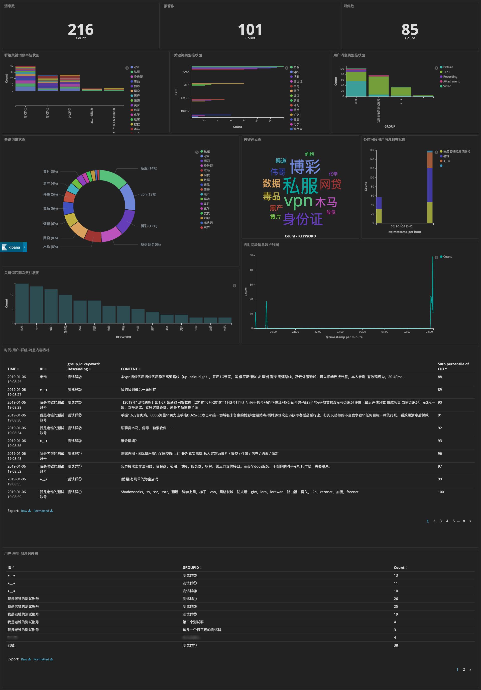

# WeChat Message Analyzer

目的：微信群组敏感信息行为记录、分析、取证、预警、可视化。

原理：使用[ItChat](https://github.com/littlecodersh/ItChat)编写微信机器人，将机器人账号伪装并添加至待监测群组，实时记录聊天内容；使用基于[Trie Tre](https://github.com/liu-nlper/KeywordProcesser)的关键字匹配实时分析威胁言论；使用ELK（Elasticsearch、Logstash、Kibana）取证并可视化预警。

技术栈：CentOS7+Nginx+Python3+SQLite3+ELK(JAVA)

源工程：SourceCode，包含一些小脚本：词云、邮件等。

混淆代码：ObfuscatedCode，使用[Oxyry](http://pyob.oxyry.com)混淆关键代码，可直接使用。

测试：SQLite3、Kibana




## CentOS

使用Docker安装CentOS7并将源码映射到系统tmp目录下：

```
docker pull centos 
docker run -it --name centos_ori -v ~/Share:/tmp centos /bin/bash
```

## Python

CentOS Linux 7自带Python2.7，使用yum管理安装Python3.6：

```
yum install epel-release
yum install https://centos7.iuscommunity.org/ius-release.rpm
yum install python36u
ln -s /bin/python3.6 /bin/python3
yum install python36u-pip
ln -s /bin/pip3.6 /bin/pip3
```

## ELK

使用rpm管理安装相应模块：

```
rpm -ivh jdk-8u131-linux-x64.rpm 
rpm -ivh logstash-6.5.4.rpm 
rpm -ivh elasticsearch-6.5.4.rpm 
rpm -ivh kibana-6.5.4-x86_64.rpm
```

elasticsearch.yml: default

```
network.host: 127.0.0.1
http.port: 9200
```

logstash.conf

```
input {
    file {
        path => [ "/home/log/log/*.log" ]
        type => "info"
        start_position => "beginning"
        codec => "json"
    }
}

filter {
    date{
        match=>["create_time", "yyyy-MM-dd HH:mm:ss"]
        locale => "en"
        timezone => "+08:00"
    }
}

output{
    stdout { codec => rubydebug }
        elasticsearch {
            hosts => ["127.0.0.1:9200"]
            index => "cs-%{+YYYY.MM.dd}"
        }
}
```

kibana.yml: default

```
server.port: 5601
server.host: 127.0.0.1
```

## Nginx

使用Nginx来反向代理ELK，同时添加访问权限。

Nginx配置文件：server_name是对外访问IP，与listen端口无关。

```
server {
    listen 80;
    server_name 192.168.1.16;

    auth_basic "Restricted Access";
    auth_basic_user_file /etc/nginx/htpasswd.users;

    location / {
        proxy_pass http://localhost:5601;
        proxy_http_version 1.1;
        proxy_set_header Upgrade $http_upgrade;
        proxy_set_header Connection 'upgrade';
        proxy_set_header Host $host;
        proxy_cache_bypass $http_upgrade;
    }
}
```

使用htpasswd生成访问密码：每次生成的密文都不一样

```
yum install -y httpd-tools
htpasswd -c /etc/nginx/htpasswd.users admin
然后在配置文件中添加auth_basic(弹窗提示内容)、auth_basic_user_file
```

## SQLite3

数据库各关键表结构：

```
-- ----------------------------
-- Table structure for wc_friends
-- ----------------------------
DROP TABLE IF EXISTS "wc_friends";
CREATE TABLE `wc_friends` (
            `id`  INTEGER PRIMARY KEY AUTOINCREMENT,
            `name`  TEXT NOT NULL,
            `sex`  TEXT,
            `province`  TEXT,
            `city`  TEXT,
            `signature`  TEXT
        );

-- ----------------------------
-- Table structure for wc_gchat
-- ----------------------------
DROP TABLE IF EXISTS "wc_gchat";
CREATE TABLE `wc_gchat` (
            `id`  INTEGER PRIMARY KEY AUTOINCREMENT,
            `create_time`  TEXT NOT NULL,
            `group_id`  TEXT NOT NULL,
            `group_one_id`  TEXT NOT NULL,
            `group_chat_text`  TEXT,
            `file_type`  TEXT,
            `file_name`  TEXT,
            `file_dst`  TEXT,
            `kw_word`  TEXT,
            `kw_type`  TEXT
        );

-- ----------------------------
-- Table structure for wc_var
-- ----------------------------
DROP TABLE IF EXISTS "wc_var";
CREATE TABLE `wc_var` (
            `gchat_count`  INTEGER NOT NULL,
            `gchat_kw_count`  INTEGER NOT NULL
        );

-- ----------------------------
-- Auto increment value for wc_friends
-- ----------------------------
UPDATE "main"."sqlite_sequence" SET seq = 238 WHERE name = 'wc_friends';

-- ----------------------------
-- Auto increment value for wc_gchat
-- ----------------------------
UPDATE "main"."sqlite_sequence" SET seq = 124 WHERE name = 'wc_gchat';

PRAGMA foreign_keys = true;
```

## 端口和进程

监听端口：

```
➜  netstat -antp | grep -i listen
tcp        0      0 0.0.0.0:80              0.0.0.0:*               LISTEN      16130/nginx: master
tcp        0      0 127.0.0.1:5601          0.0.0.0:*               LISTEN      10257/node
tcp6       0      0 :::80                   :::*                    LISTEN      16130/nginx: master
tcp6       0      0 127.0.0.1:9200          :::*                    LISTEN      10033/java
tcp6       0      0 127.0.0.1:9300          :::*                    LISTEN      10033/java
tcp6       0      0 127.0.0.1:9600          :::*                    LISTEN      10163/java
```

相应进程：

```
➜  ps aux | grep 16130
root      16130  0.0  0.0 125008  2280 ?        Ss   18:56   0:00 nginx: master process /usr/sbin/nginx
➜  ps aux | grep 10033
elasticsearch  10033  1.7 25.2 4896104 1493920 ?     Ssl  17:12   2:32 /bin/java -Xms1g -Xmx1g ... org.elasticsearch.bootstrap.Elasticsearch -p /var/run/elasticsearch/elasticsearch.pid --quiet
➜  ps aux | grep 10163
logstash  10163  2.8 14.0 4719420 833064 ?      SNsl 17:13   4:02 /bin/java -Xms1g -Xmx1g ... --path.settings /etc/logstash -f /etc/logstash/conf.d/logstash.conf
➜  ps aux | grep 10257
kibana    10257  0.8  5.0 1447288 301796 tty1   Sl   17:13   1:11 /usr/share/kibana/bin/../node/bin/node --no-warnings /usr/share/kibana/bin/../src/cli -c /etc/kibana/kibana.yml
```

## TODO

- [x] 日志格式化JSON
- [x] logstash conf 时间头问题
- [x] log记录中文问题
- [x] 群组聊天内容数据库
- [x] 消息数等关键数值数据存数据库，程序入口值问题
- [x] 私聊信息处理
- [x] 群组位置、名片、分享消息数据类型处理
- [x] kibana、logstash时间统一问题：timestamp使用的UTC时间...修改logstash配置，设置时区，并偏移8小时
- [x] 预警，指定用户回复功能
- [x] 指定好友发送消息，好友检索问题
- [ ] 分析保存的视频、音频、图像、名片等消息内容。
- [ ] 群成员信息获取？
- [ ] 私聊内容进库，是否需要处理，前端展示？
- [ ] 好友信息索引，cron定时执行？好友人数、位置信息等

## Contributors

感谢学弟：littleghost2016
